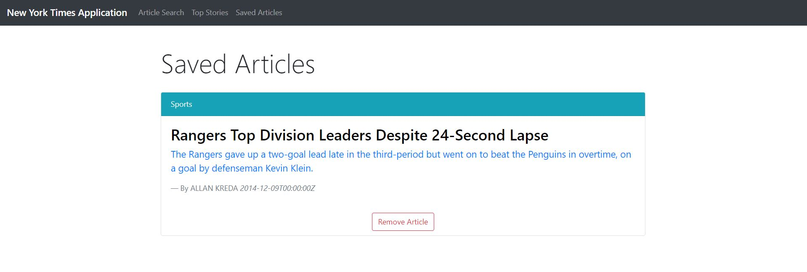

# react-express-mysql
an application created with React.js using express and mysql for maintaining persistent data. The Application uses a NY Times API to search news and save articles you want to refer back to later.

## Technologies used:
- HTML
- CSS
- jQuery
- moment.js
- React.js
- mySQL
- express
- sequelize
- NY Times API
- React-Router
- Concurrently

## Screenshots:
### Landing page/ Article Search :

### Search Results:

### Saved Articles Page:

### Top Stories Page:

## Author :
- Michael Emmons
